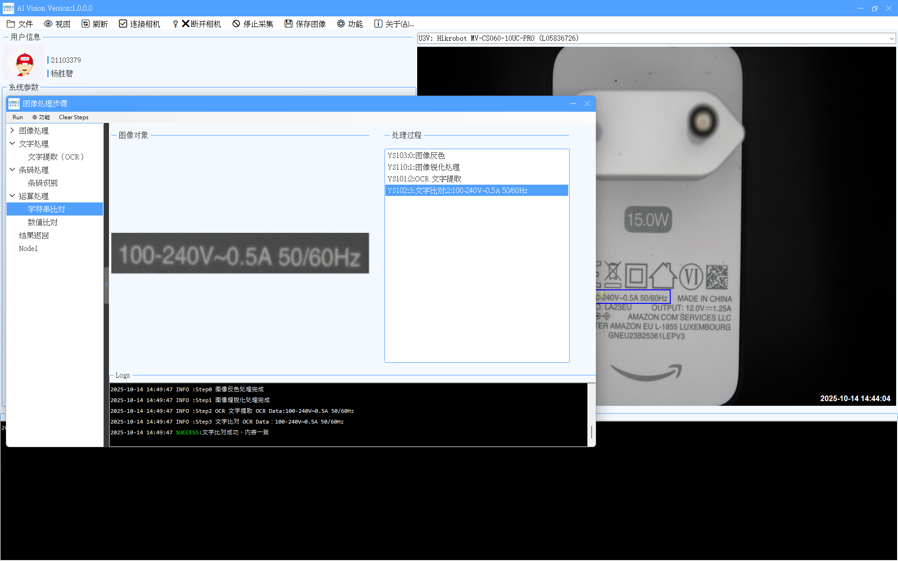

# 🌐 NetAIVision - 智能视觉检测系统

> **Version 1.0 | 专为工业视觉与AI集成设计**

---

## 🔐 使用声明

⚠️ **本产品仅供学习和研究使用**  
使用者应严格遵守国家相关法律法规，严禁将本系统用于任何非法活动。  

🚫 禁止行为包括但不限于：
- 破坏计算机系统或网络服务
- 非法获取、篡改或泄露数据
- 传播恶意程序或攻击工具
- 干扰他人正常网络与设备运行

📌 **因滥用本产品所引发的一切法律责任，均由使用者自行承担。**  
请自觉遵守《中华人民共和国网络安全法》及相关法规，合法合规使用技术。

---

## 🧩 核心功能模块

| 功能 | 说明 |
|------|------|
| 🎥 **Video 采集** | 基于海康威视相机 SDK 实现高清视频流采集 |
| 📝 **OCR 识别** | 支持中英文文本检测与识别（Tesseract / PaddleOCR） |
| 🧮 **ROI Step 处理** | 区域兴趣（ROI）分步处理流程，支持多阶段逻辑控制 |
| 🖼️ **图像比对** | 基于模板匹配与特征提取的差异检测算法 |
| 🛠️ **OpenCV 集成** | 全面调用 OpenCV 进行图像预处理与分析 |
| 🤖 **AI 拼词检测** | 自研 AI 模型用于字符异常拼接识别（如错字、漏打） |
| 🔗 **MES 联动** | 实时对接 Chroma MES 系统，自动上传检测结果与参数 |

---

## 👤 开发者信息

> **Author**: Victory  
> **Organization**:  liteon
> **Contact**: yysvent@163.com
> **GitHub**: [https://github.com/yourname/NetAIVision](https://github.com/Countonme/NetAIVision)  
> **Build Date**: 2025年4月5日  
> **License**: 仅供学习交流 · 保留所有权利 © 2025

---

## 🖼️ 系统界面预览

> *图示：NetAIVision 主界面 - 支持多任务流程可视化操作*

---

## 📎 备注

本项目致力于推动工业智能化发展，倡导“技术向善”理念。  
欢迎技术交流，拒绝任何形式的技术滥用。

💡 **技术用于正道，智能创造价值。**